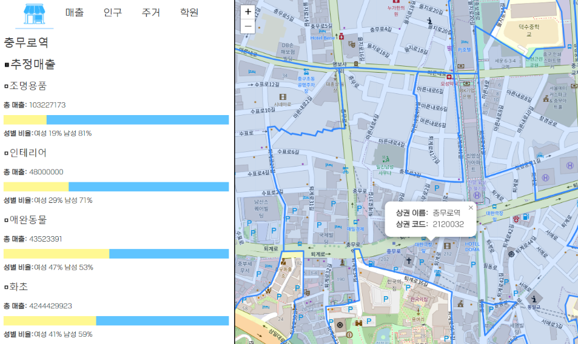

# 상권분석 서비스
* 상권분석에 집중한 프로젝트가 아님을 알려드립니다
* 상권분석을 위한 분산 빅데이터 서비스 시스템 구현

> 기존 상권분석 서비스에서 원하는 상권영역의 분석 결과를 제공받기 위해 원하는 상권영역을 클릭해도 다시 목록에서 시군구부터 선택해줘야 하는 사용자 편의성 부족의 문제가 있다. 이에 대응하기 위해 User Interface 개선을 하고 방대한 데이터를 처리하기 위해 분산 데이터베이스, 분산 시스템을 구성한다

## 주요 기능
* 파일 업로드 기능

* 상권분석 결과 조회 기능


## 결과
* Front-End
  * 파일 업로드/upload_file(request): 국가명, 도시를 입력받고 파일 업로드, 업로드된 파일은 백엔드로 전송
  
  * 원하는 구역의 상권분석 요청
    * 서울 행정동 경계지도를 띄움
    * 구역 위에 hover하면 해당 구역의 상권이름과 상권코드 정보를 팝업
    * 특정 구역을 클릭하면 해당 구역의 상권이름과 상권코드 정보를 백엔드로 전달하여 상권분석결과 요청
    * 전달받은 데이터를 그래프로 그림 
      (전달받은 데이터 중 추정매출 그리기만 함)
    


## 구현환경
```
Python==3.9.6
Django==4.1.7
MongoDB==7.0.2
Celery==5.3.4
Mysql==8.1.0
RabbitMQ==3.12.6
Flower==2.0.1
```